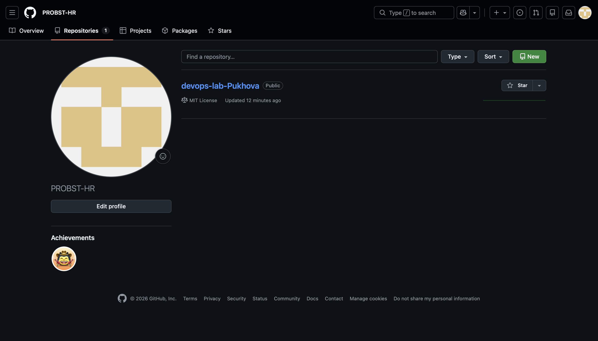
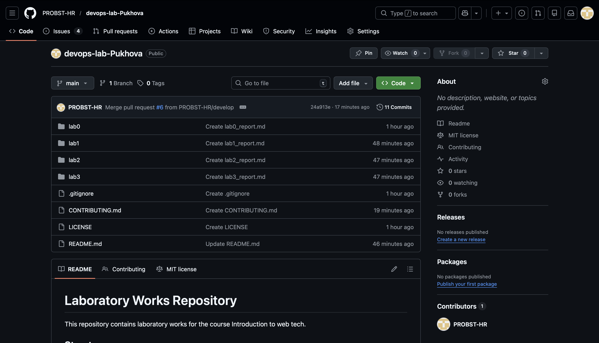
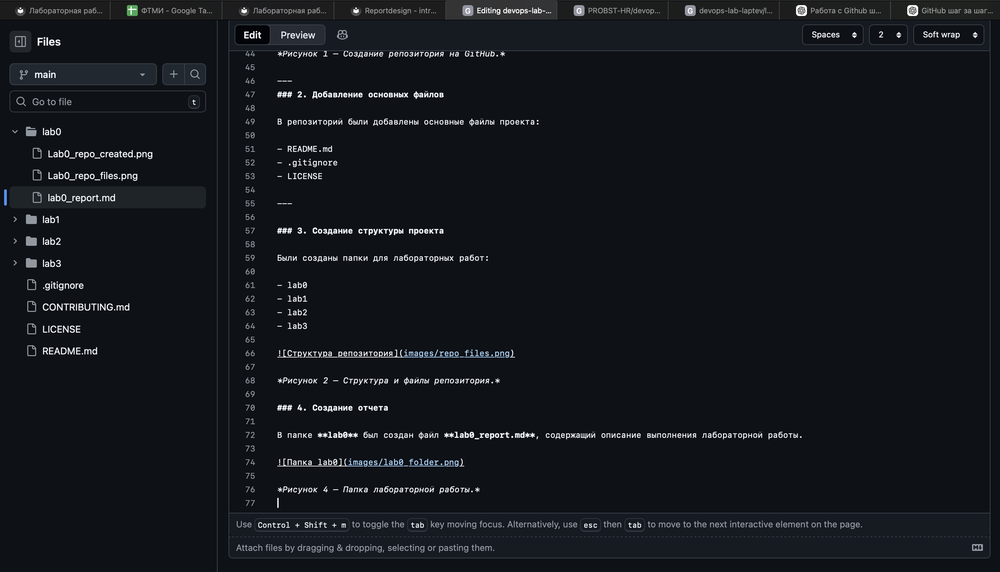

University: ITMO University  
Faculty: FTMI  
Course: Intro Web Technologies  
Year: 2025/2026  
Group: U4125  
Author: Diana Pukhova  
Lab: Lab0  
Date of create: 27.02.2026  
Date of finished: 20.03.2026

Description of laboratory work 0.

---

# Lab 0: Создание репозитория и настройка рабочего окружения

## Цель работы

Целью данной лабораторной работы является знакомство с системой контроля версий Git и платформой GitHub. Также необходимо создать репозиторий для хранения лабораторных работ и настроить базовую структуру проекта.

---

## Задачи

В рамках лабораторной работы необходимо выполнить следующие задачи:

- создать аккаунт на GitHub  
- создать репозиторий для лабораторных работ  
- добавить основные файлы проекта  
- настроить структуру каталогов  
- создать отчет о выполнении лабораторной работы  

---
## Ход работы

Создание репозитория

На платформе GitHub был создан новый репозиторий для хранения лабораторных работ по курсу.

*Рисунок 1 — Создание репозитория на GitHub.*

Добавление основных файлов

В репозиторий были добавлены основные файлы проекта:

- README.md
- .gitignore
- LICENSE

Создание структуры проекта

Были созданы папки для лабораторных работ:

- lab0
- lab1
- lab2
- lab3

*Рисунок 2 — Структура и файлы репозитория.*

Создание отчета

В папке **lab0** был создан файл **lab0_report.md**, содержащий описание выполнения лабораторной работы.

*Рисунок 3 — Папка лабораторной работы.*

В ходе выполнения лабораторной работы были использованы следующие инструменты:

- Git  
- GitHub  
- Markdown  

# Результат

В результате выполнения лабораторной работы был создан GitHub репозиторий с базовой структурой для выполнения лабораторных работ. В репозитории присутствуют основные файлы проекта и папки для хранения отчетов.

# Вывод

В ходе лабораторной работы были получены базовые навыки работы с системой контроля версий Git и платформой GitHub. Также была изучена структура репозитория и принципы организации лабораторных работ в GitHub.
