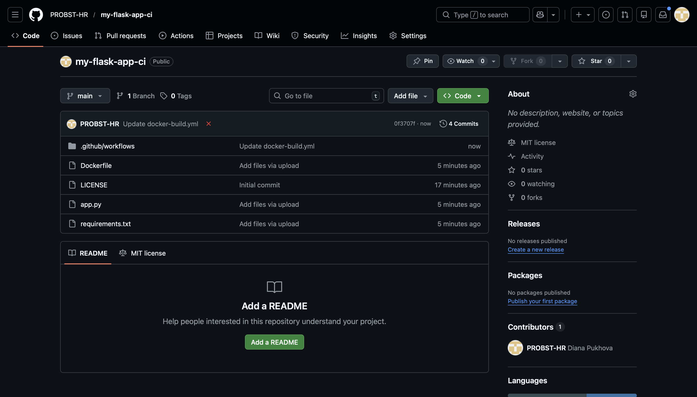
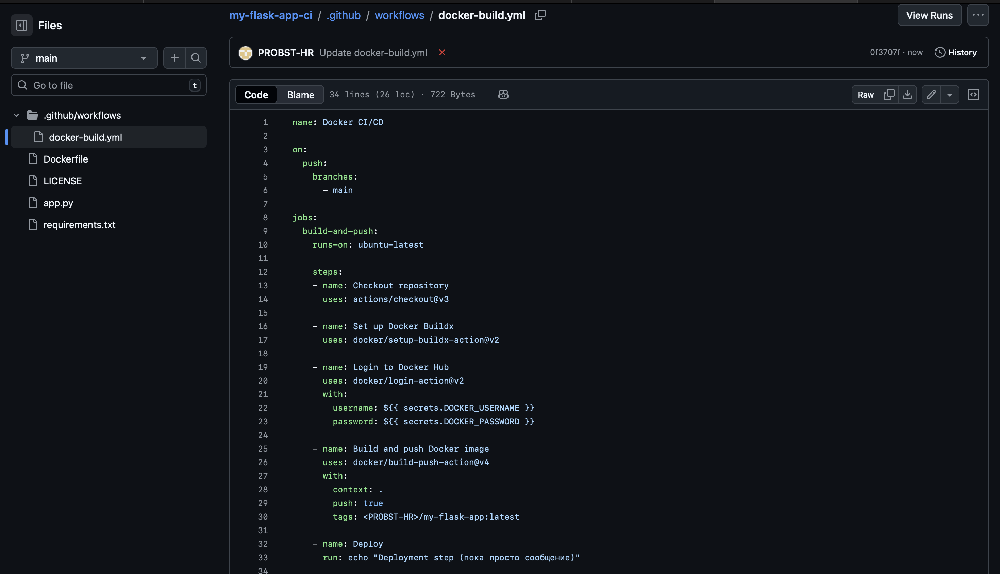
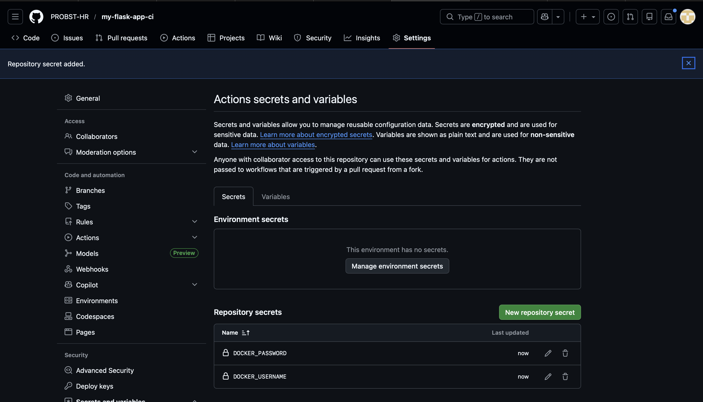
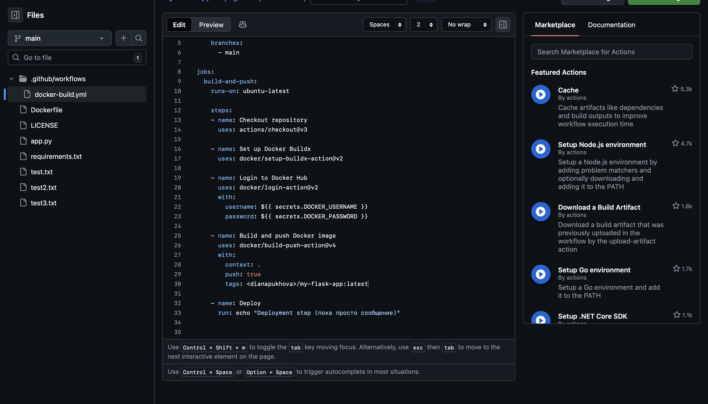
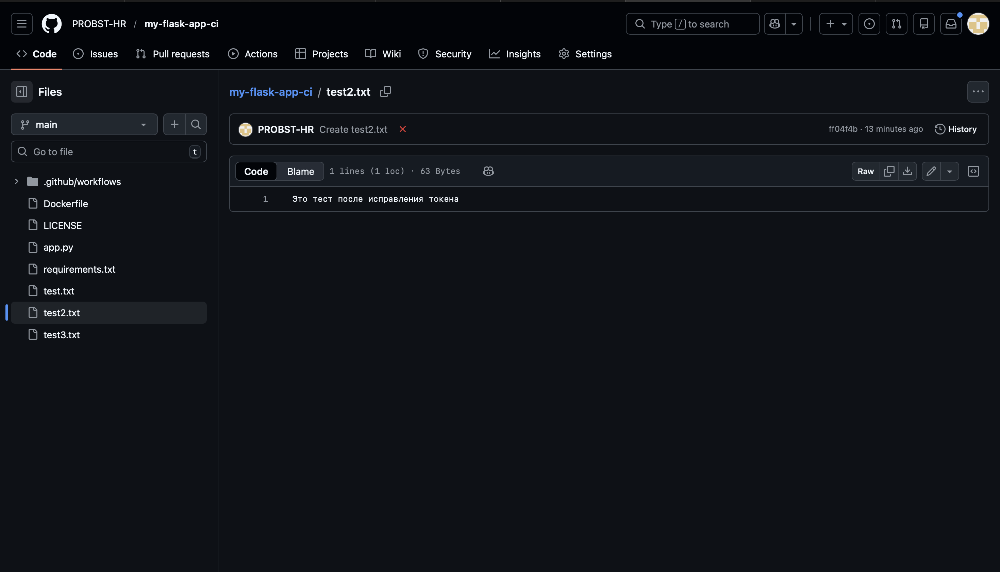
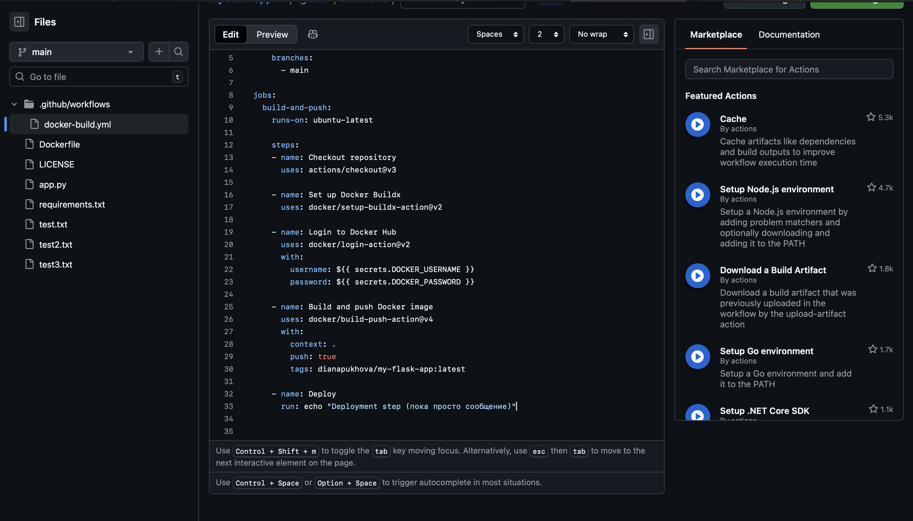
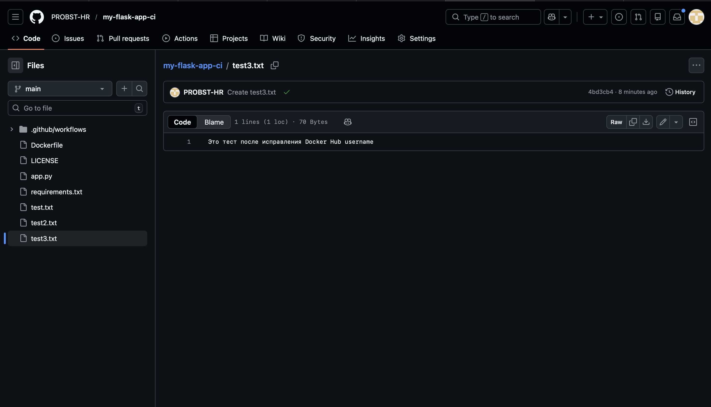
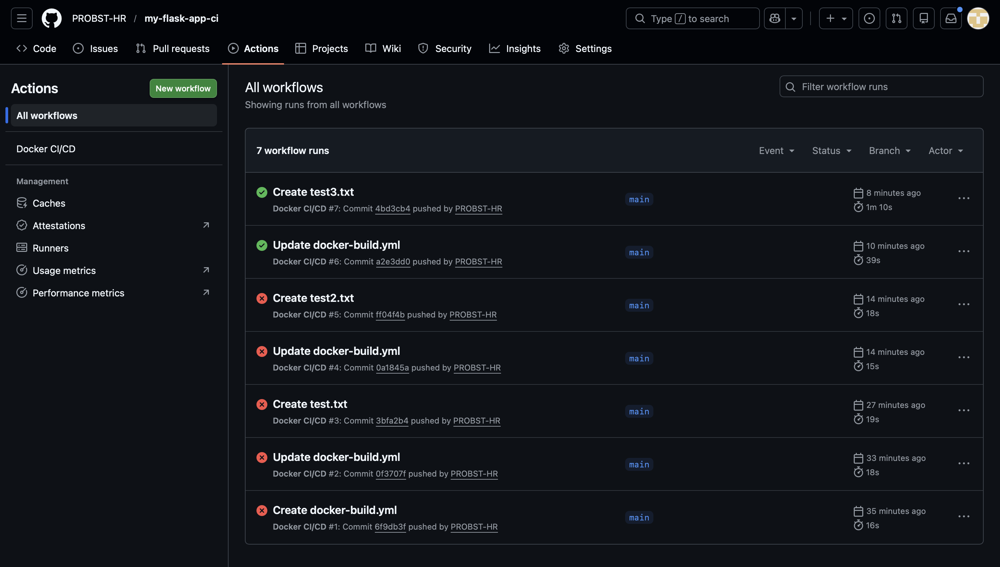
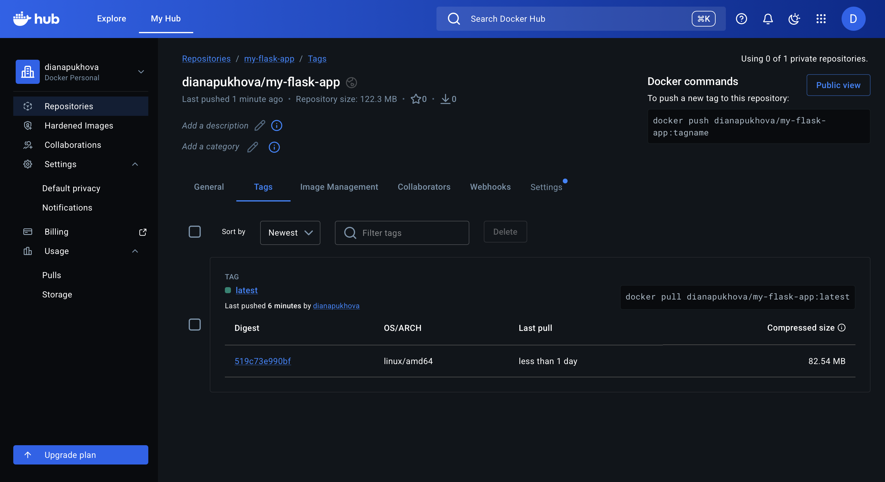

# Лабораторная работа №2: CI/CD для Docker приложения

## Цель работы
Настроить автоматизированный пайплайн для сборки Docker образа из Flask приложения, публикации в Docker Hub и проверки деплоя с помощью GitHub Actions.

---

## Ход работы

Подготовка проекта
1. Создан новый репозиторий на GitHub:  
   - Название: `my-flask-app-ci`  
   - Ветка по умолчанию: `main`
     
2. Скопированы файлы из первой лабораторной работы:  
   - `app.py` – основной код Flask приложения  
   - `requirements.txt` – зависимости Python  
   - `Dockerfile` – инструкция сборки Docker образа

   
3. Сделан первый коммит через веб-интерфейс GitHub
4. Создан файл workflow `docker-build.yml`

 
5. В репозитории GitHub добавлены секреты для авторизации в Docker Hub,
DOCKER_USERNAME	dianapukhova (Первая ошибка <PROBST-HR>, вторая ошибка <dianapukhova>)
DOCKER_PASSWORD	токен доступа Docker Hub:

   
6. Сделан фиктивный коммит для запуска workflow:
Создан файл test.txt 

Commit message: "Test CI/CD", появилась ошибка из-за в имени, так как изначально было написано неверное имя PROBST-HR вместо dianapukhova

7. Создан файл test2.txt

Все равно появлялась ошибка, я поняла, что это синтексическая ошибка, Символы < и > не должны использоваться.
Docker не понимает <***> как имя пользователя и выдаёт “invalid reference format”

8. Исправлен тег Docker образа (<***>/my-flask-app:latest → dianapukhova/my-flask-app:latest) после ошибки invalid reference format.

9. Снова сделан фиктивный коммит для запуска workflow:
Создан файл test3.txt

После исправления workflow выполнялся успешно. 
   

10. После успешного выполнения workflow образ появился в Docker Hub. Образ готов к использованию и автоматическому деплою.
 

# **Итог** 
В ходе лабораторной работы был настроен автоматизированный CI/CD пайплайн для Docker приложения с помощью GitHub Actions. Были выполнены следующие ключевые шаги:
Создан новый репозиторий на GitHub и загружены файлы Flask приложения (app.py, requirements.txt, Dockerfile).
Создан репозиторий на Docker Hub и настроен токен доступа для безопасной авторизации.
Настроен workflow docker-build.yml для автоматической сборки и публикации Docker образа при каждом пуше в ветку main.
Добавлены секреты DOCKER_USERNAME и DOCKER_PASSWORD для безопасного логина в Docker Hub.
Проверен пайплайн через фиктивные коммиты: ошибки исправлены, workflow успешно выполняется.
Docker образ автоматически появился в Docker Hub с тегом latest и готов к использованию.
## **Вывод**: 
CI/CD настроен корректно, автоматическая сборка и публикация Docker образа при изменении кода работают успешно, цель лабораторной работы достигнута.
