University: ITMO University  
Faculty: FTMI  
Course: Intro Web Technologies  
Year: 2025/2026  
Group: U4125  
Author: Diana Pukhova  
Lab: Lab0  
Date of create: 27.02.2026  
Date of finished: 20.03.2026

Description of laboratory work 3. 

---

# Lab 2 Report: CI/CD для Docker приложения

## Цель работы  

Научиться настраивать локальную систему мониторинга, собирать метрики с помощью Prometheus и создавать дашборды в Grafana для визуализации данных.  

---

## Ход работы  

Настройка Prometheus

Создала папку `prometheus` для конфигурации.
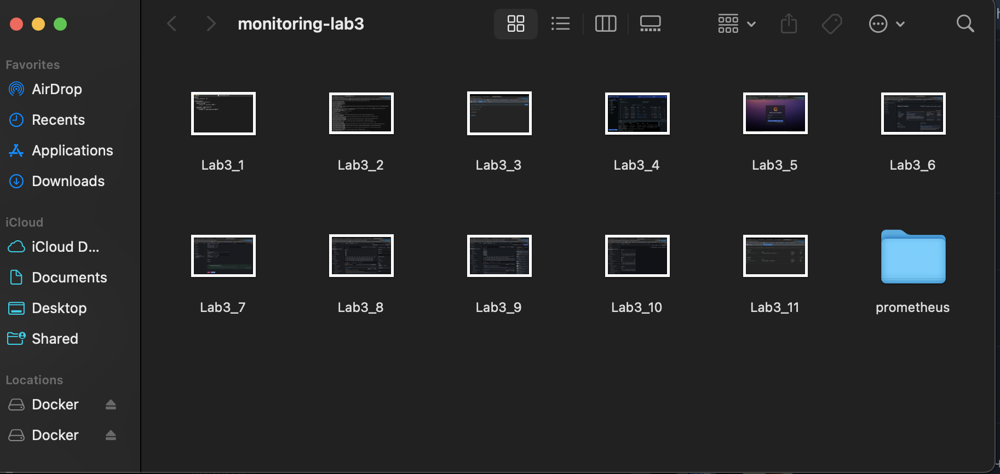
    
Создала файл `prometheus/prometheus.yml`
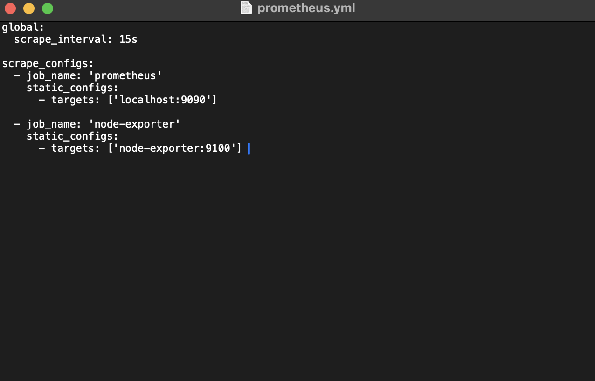
   
Контейнер Node Exporter запущен и проверен
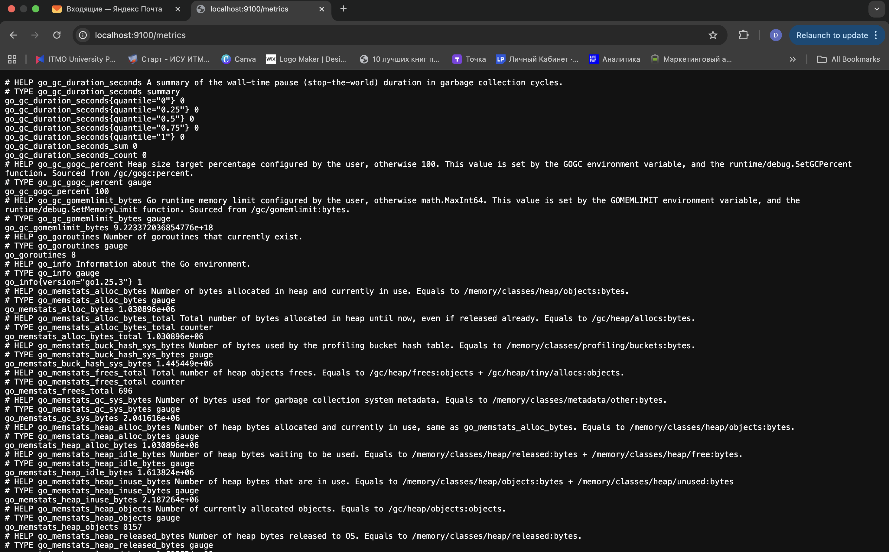

Запустила Prometheus: создала том для данных, создала общую сеть для мониторинга, контейнер Prometheus запущен и проверен
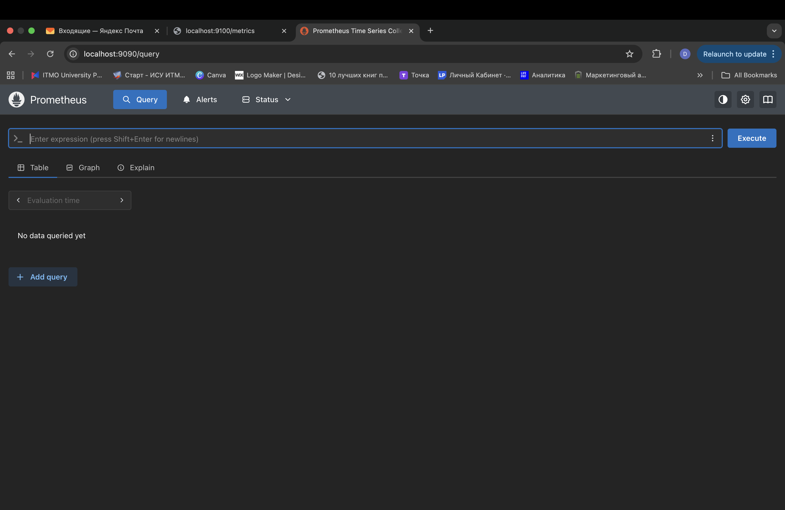

Запустила Grafana: cоздала том для данных, контейнер Grafana запущен и проверен
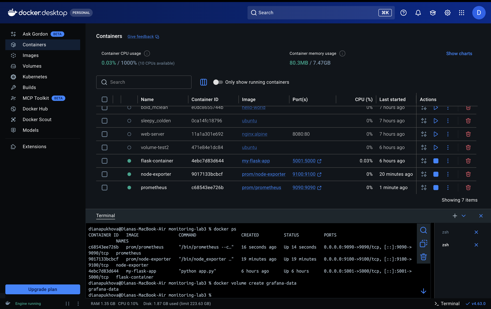
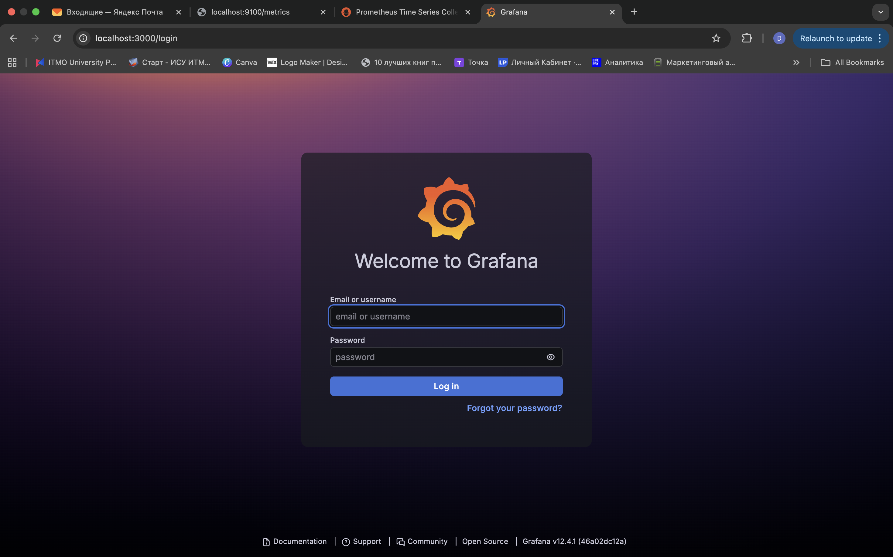
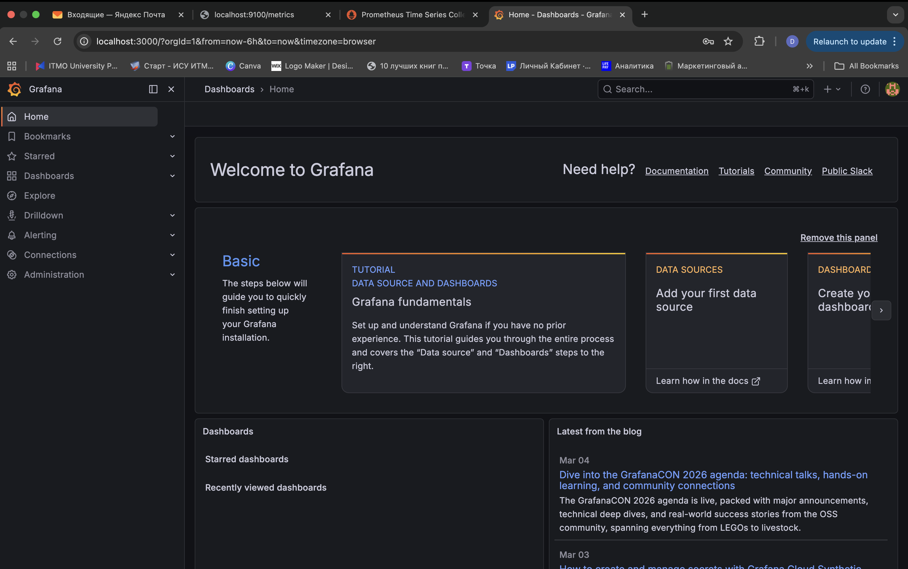

Настройка Grafana: добавила источник данных Prometheus, создала Dashboard с тремя панелями, графики отображают текущее использование CPU, RAM и диска. Панели обновляются автоматически каждые 15 секунд.
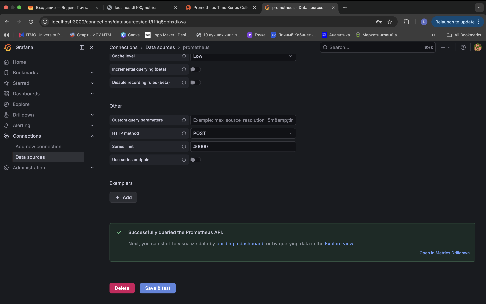
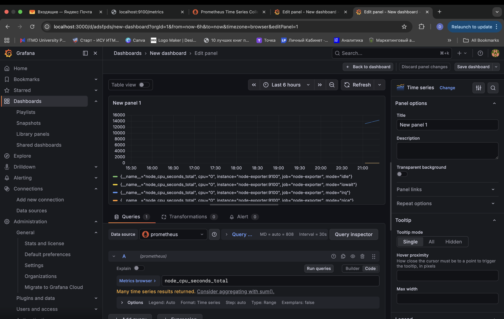
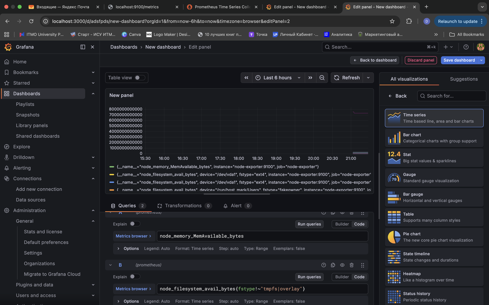
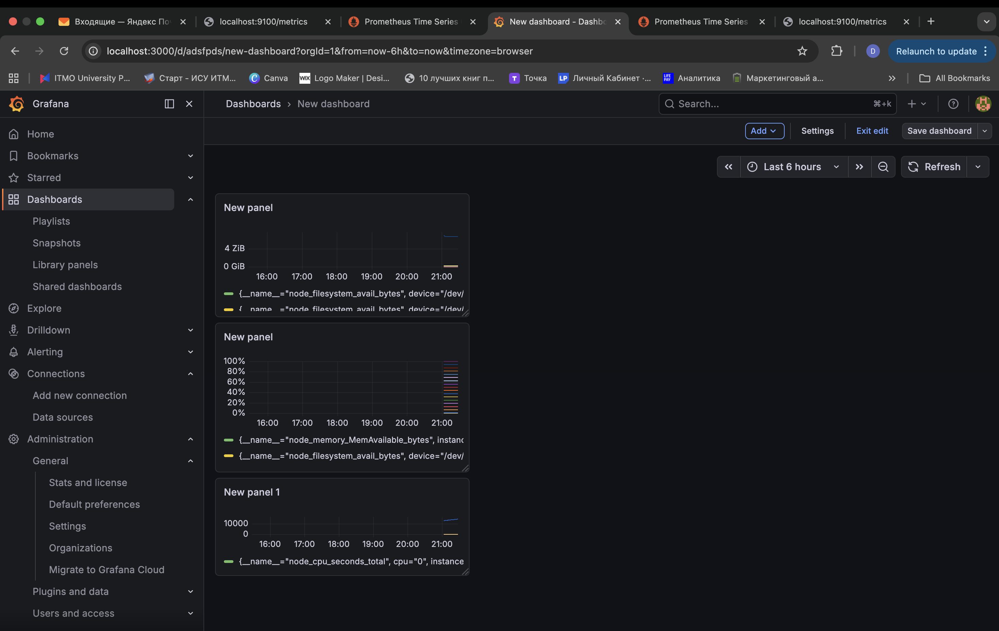

Проверила контейнеры, все контейнеры запущены: Prometheus, Node Exporter, Grafana.
Проверка метрик:
Prometheus: http://localhost:9090/targets → все цели UP
Node Exporter: http://localhost:9100/metrics → метрики собираются
Grafana: Dashboard с графиками CPU, памяти и диска отображается корректно
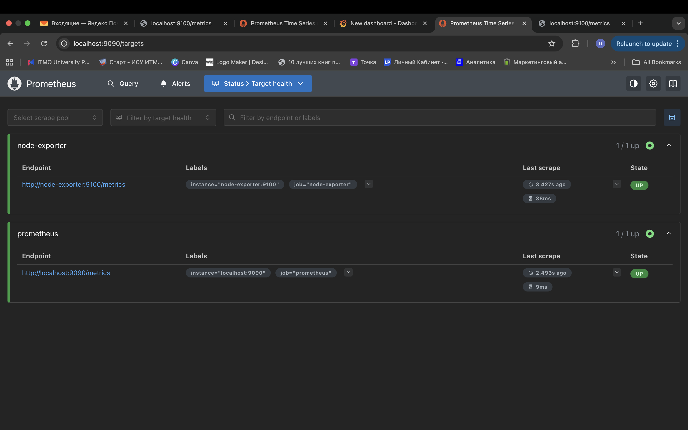

# Вывод
Настроена локальная система мониторинга с использованием Prometheus и Grafana.
Метрики собираются с Node Exporter, визуализируются на Dashboard Grafana.
Созданы панели для CPU, памяти и диска, настроены единицы измерения и графики.
Система мониторинга полностью готова к использованию и тестированию веб-приложений.
