University: ITMO University  
Faculty: FTMI  
Course: Intro Web Technologies  
Year: 2025/2026  
Group: U4125  
Author: Diana Pukhova  
Lab: Lab0  
Date of create: 27.02.2026  
Date of finished: 20.03.2026

Description of Kursovaya work. 

---

## 1. Цель работы

Целью работы является создание персонального сайта с использованием технологии **MkDocs** и языка разметки **Markdown**, а также публикация сайта в сети Интернет с использованием GitHub Pages.

---

## 2. Используемые технологии

- Python
- MkDocs
- Тема Material for MkDocs
- Markdown
- Git
- GitHub
- GitHub Pages

---

## 3. Этапы выполнения работы

---

### Этап 1. Установка и подготовка

1. Установлен Python.
2. Установлен MkDocs.
3. Установлена тема Material.
4. Проверена версия MkDocs.
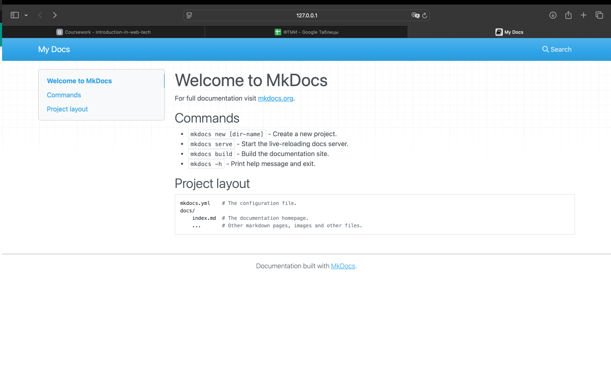

---

### Этап 2. Создание проекта

1. Создана папка проекта.
2. Выполнена команда `mkdocs new .`
3. Изучена структура проекта.

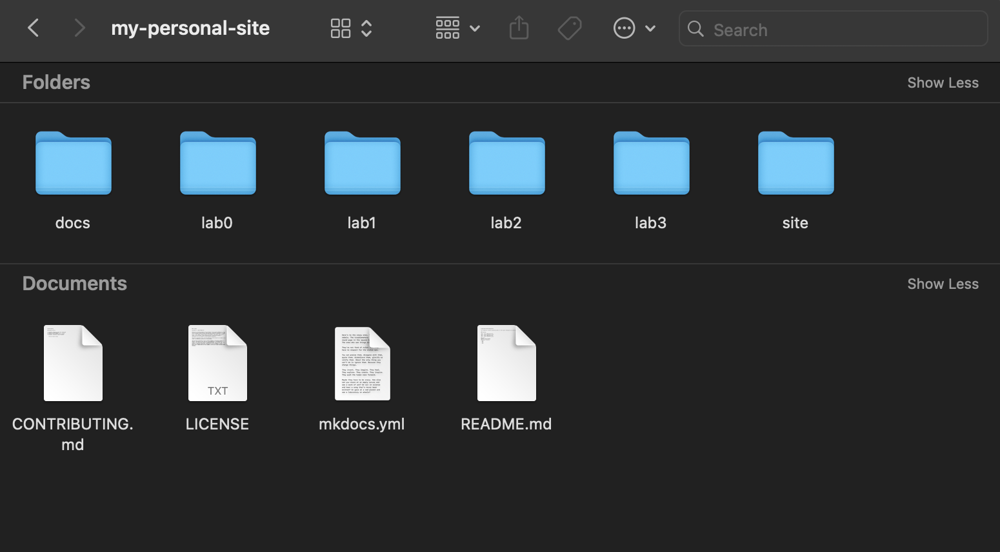

---

### Этап 3. Настройка конфигурации (mkdocs.yml)

Настроены параметры:

- site_name
- site_description
- site_author
- тема Material
- навигация

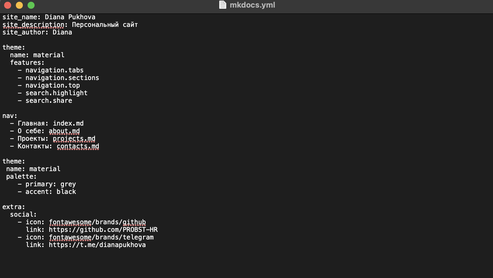

---

### Этап 4. Создание страниц

Созданы страницы:

- Главная (index.md)
- О себе (about.md)
- Проекты (projects.md)
- Контакты (contacts.md)

Использованы элементы Markdown:

- Заголовки
- Списки
- Таблицы
- Ссылки
- Изображения
- Цитаты

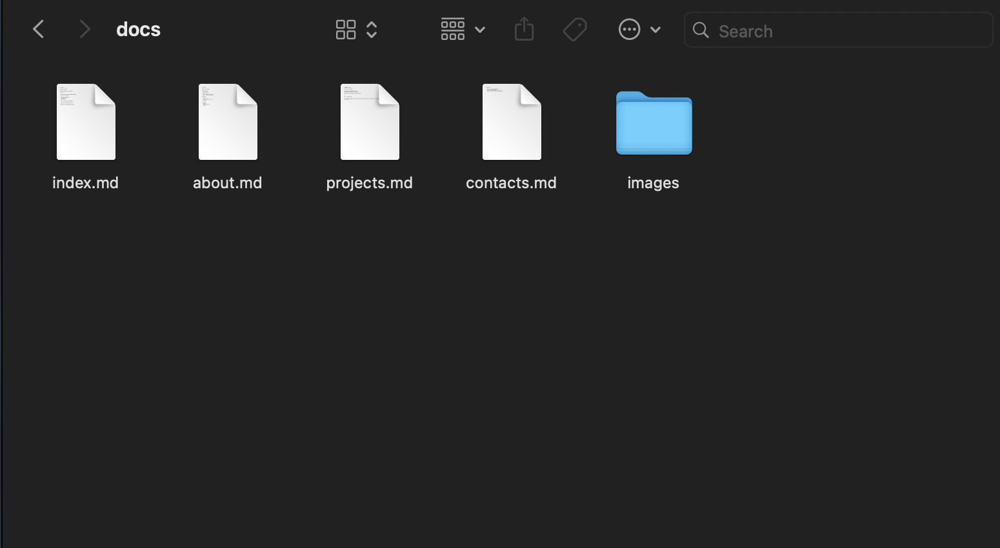
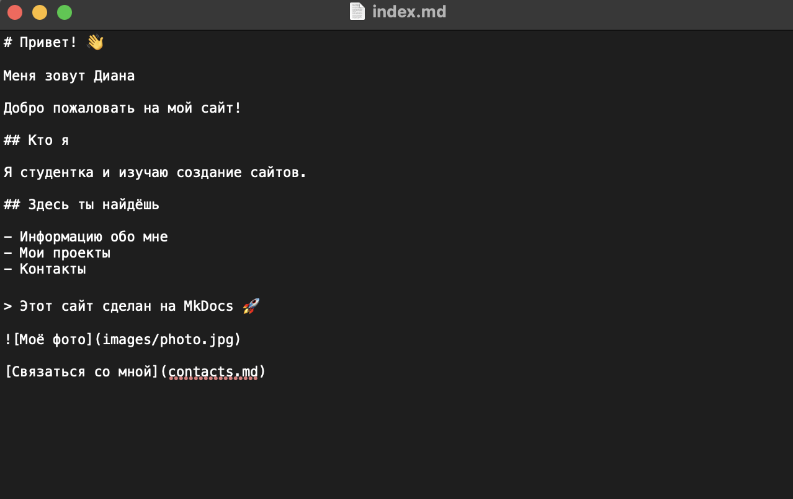
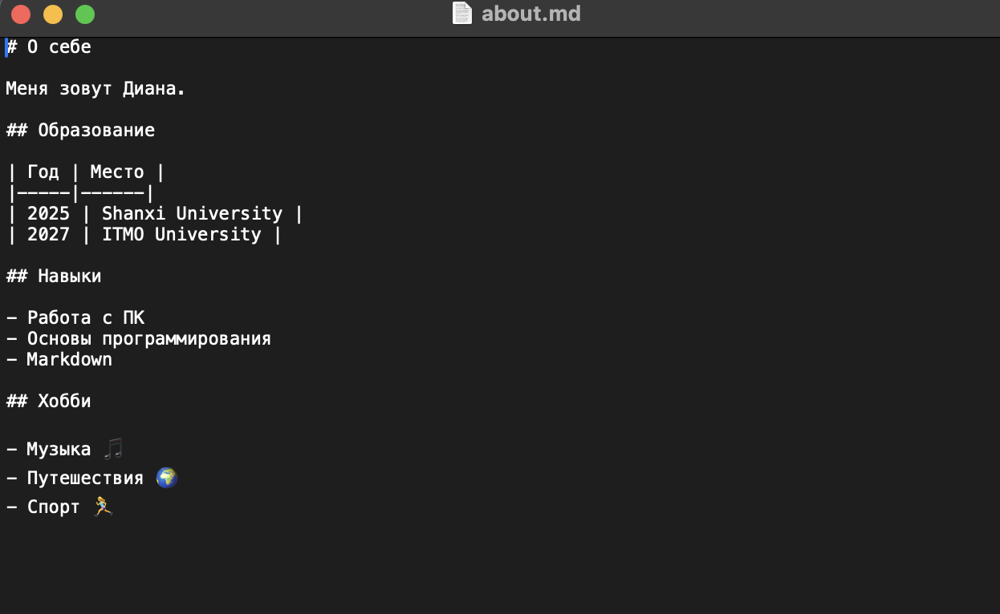
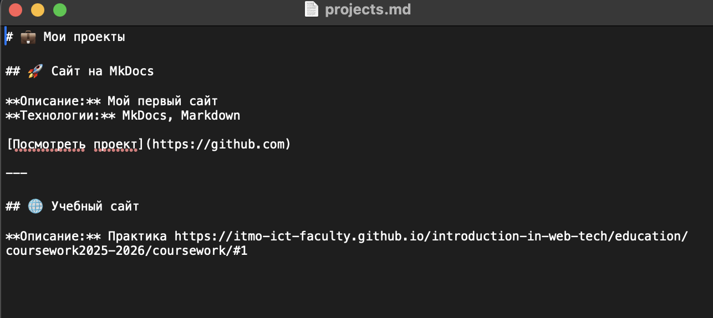
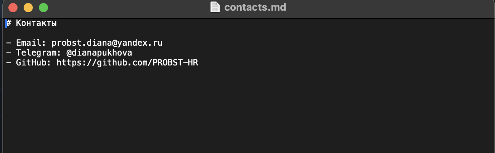

---

### Этап 5. Локальное тестирование

Сайт запущен и проверена работа сайта по адресу http://127.0.0.1:8000

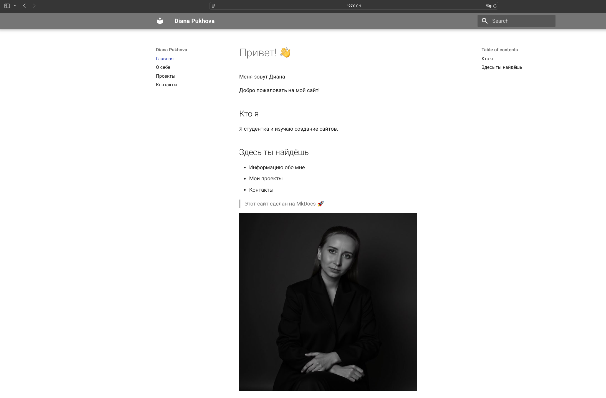

---

### Этап 6. Сборка сайта

Выполнена команда:
mkdocs build

Создана папка `site/` со статическими файлами.

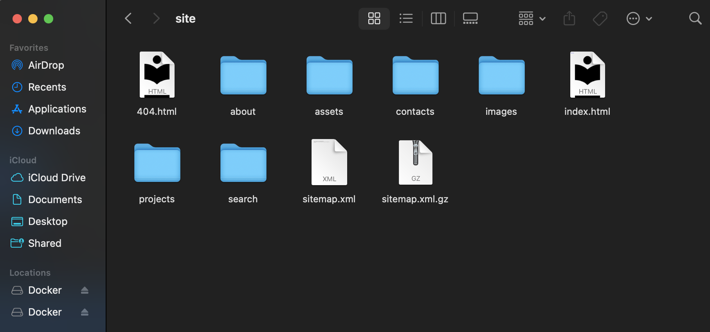

---

### Этап 7. Публикация на GitHub Pages

Выполнена команда:
mkdocs gh-deploy

Сайт опубликован на GitHub Pages.

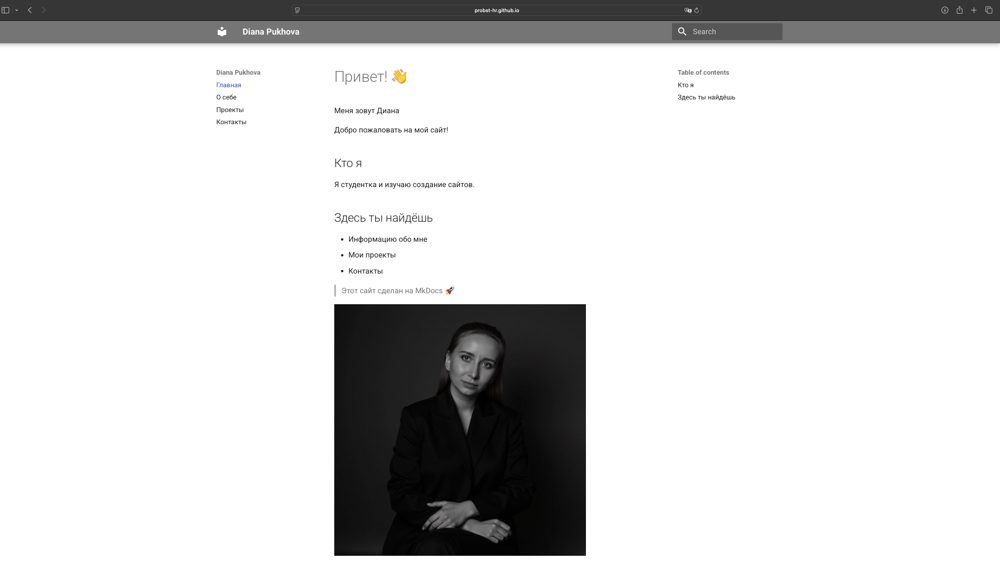

---

## 4. Результат работы

В результате:

- Создан персональный сайт
- Использована тема Material
- Настроена навигация
- Реализованы минимум 4 страницы
- Использованы элементы Markdown
- Сайт опубликован в интернете

---

## 5. Ссылка на проект

GitHub:
https://github.com/PROBST-HR/devops-lab-Pukhova

Публичный сайт:
https://probst-hr.github.io/devops-lab-Pukhova/ 

---

## 6. Вывод

В ходе работы были изучены технологии MkDocs и Markdown.  
Создан и опубликован персональный сайт.  
Получены навыки структурирования информации и работы с системой контроля версий Git.

